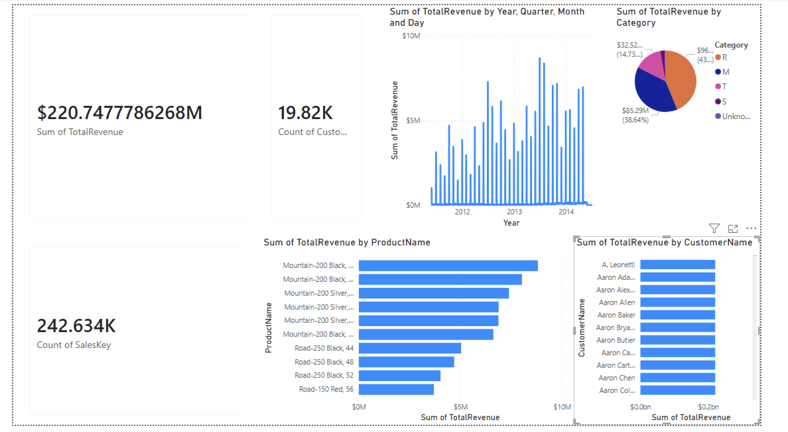

AdventureWorks Data Warehouse Project

This project implements a complete Medallion Architecture Data Warehouse using SQL Server, AdventureWorks2022 and Power BI.

Technologies :
- SQL Server
- SSMS
- Power BI
- AdventureWorks2022
- GitHub

Architecture : Bronze → Silver → Gold

KPIs :
- Total Revenue
- Total Orders
- Revenue by Category
- Top Customers
- Top Products
- Sales Evolution

 